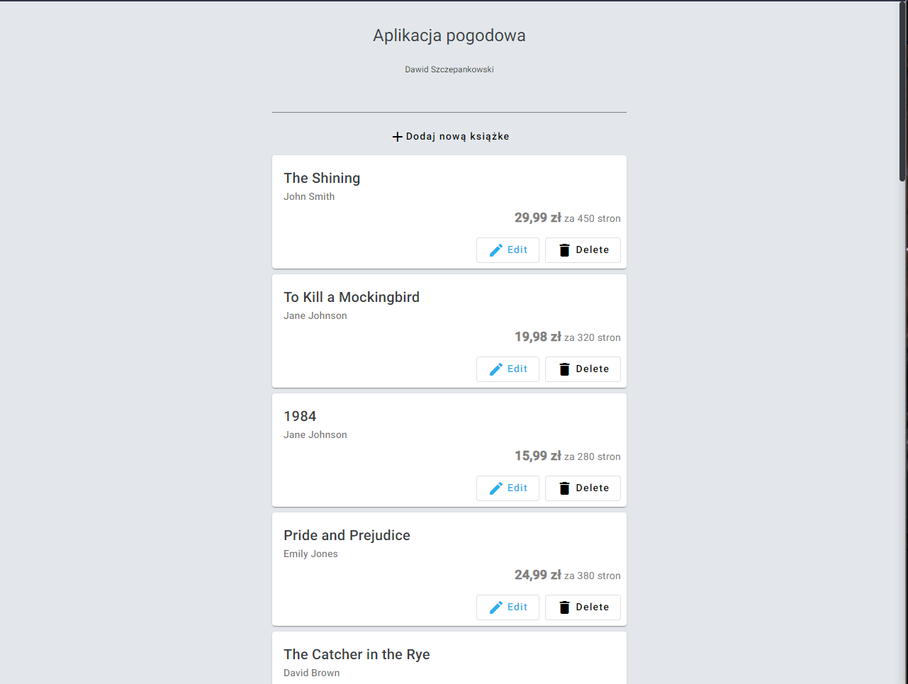
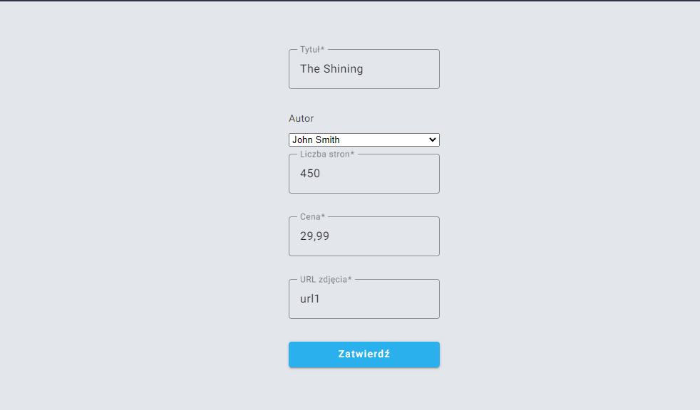
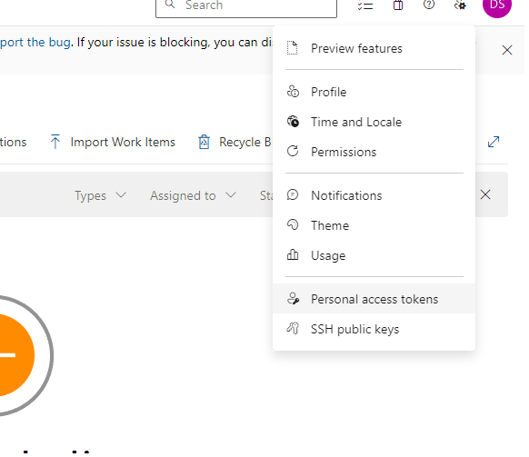
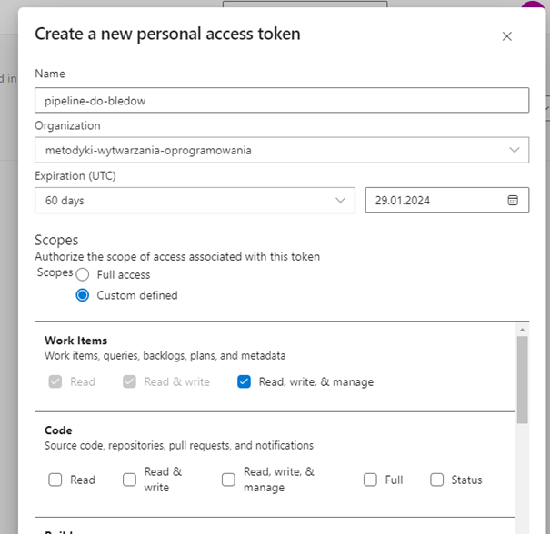
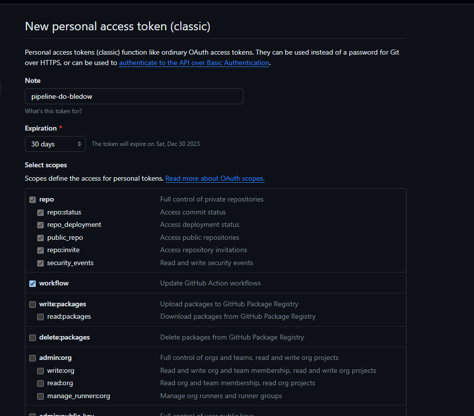
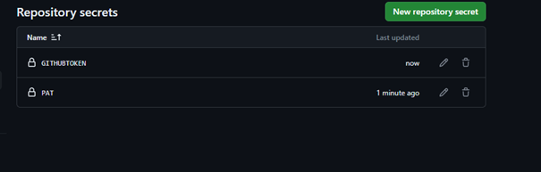

# Metodyki wytwarzania oprogramowania- Zadanie 5 - Projekt

## Aplikacja Angular, która będzie testowana

Testowana będzie aplikacja webowa, posiadająca w sobie moduł do logowania przy pomocy JWT oraz proste operacje crud na zbiorze książek. Aplikacja została wytworzona zgodnie z wzorcem MVC oraz przy wykorzystaniu angulara w wersji 16.



## Testy ui z wykorzystaniem Selenium

Testy aplikacji zostały napisane z wykorzystaniem biblioteki Selenium. Jako framework do pisania testów wykorzystany
został JUnit 5. Ponadto użyto biblioteki AssertJ do asercji oraz biblioteki Faker do generowania losowych danych.
Dodatkowo biblioteka Testcontainers została wykorzystana do tworzenia testowej instancji bazy danych.

Selenium zostało skonfigurowane w następujący sposób (opcja headless pozwala uruchomić testy w środowisku GitHub
Actions):

Testy zostały napisane przy użyciu Selenium, żeby testy mogły działać należało doinstalować bibliotekę **selenium-webdriver**.
Testy zostały umieszczone w pliku **e2e/test-crud.js**. Żeby testy mogły poprawnie działać, także w środowisku github actions należało zmodyfikować konfigurację.

```javascript
  let driver;
  const chromeOptions = new chrome.Options().headless();

  driver = await new Builder().forBrowser('chrome').setChromeOptions(chromeOptions).build();
  await driver.get('http://localhost:4200');
```
Testy są uruchamiane przy pomocy drivera chrome ale z opcją headless - przeglądarka nie jest uruchamiana co umożliwa nam działanie poprawnie działanie testów podczas pipeline'ów.

Przykładowy test napisany przy użyciu selenium:

```javascript

const addItem = async () => {
  let driver = await getDriver();

  await driver.findElement(By.id('add__button')).click();
  await driver.wait(until.urlIs("http://localhost:4200/addBook"), 5000);

  await driver.findElement(By.id('dialog_title_input')).sendKeys('Sample Book Title To test');

  const authorDropdown = await driver.findElement(By.id('dialog_author_input'));
  const authorSelect = new Select(authorDropdown);
  authorSelect.selectByVisibleText('David Brown');

  await driver.findElement(By.id('dialog_pageCount_input')).sendKeys('200');
  await driver.findElement(By.id('dialog_price_input')).sendKeys('25.99');
  await driver.findElement(By.id('dialog_photoUrl_input')).sendKeys('https://example.com/book-image.jpg');

  await driver.findElement(By.id('dialog_submit_button')).click();
  await driver.wait(until.urlIs("http://localhost:4200/home"), 5000);

  const isBookAdded = await driver.findElement(By.id('Sample-Book-Title-To-test')).isDisplayed();

  if (!isBookAdded) throwError(driver, "New book was not added");
  await driver.quit();
};

```

Aby naraz uruchamiać do testowania oraz testować aplikacji użyłem biblioteki: **start-server-and-test**. Po użyciu komendy **npm run test-e2e**. Uruchamiany jest tymczasowy serwer oraz testowana jest aplikacja. Po zakończeniu testów serwer automatycznie jest wyłączany.

## Konfiguracja Github Actions i Azure DevOps

Do konfiguracji zgłaszanego błędu użyłem akcji z marketplace-u githuba stefanstranger/azuredevops-bug-action@1.1. Żeby ta akcja działała należało uworzyć personal-access-token na azure devops.




Oraz utworzyć github token



oraz zapisać oba tokeny jako sekrety



Utworzona akcja githubowa:

```yaml
name: Angular CI/CD
on:
  pull_request:
    branches:
      - development
  workflow_dispatch:
jobs:
  build:
    runs-on: ubuntu-latest
    steps:
      - name: Checkout Repository
        uses: actions/checkout@v3
      - name: Setup Node.js and npm
        uses: actions/setup-node@v3.8.1
        with:
          node-version: 20
      - name: Install dependencies
        run: npm install
      - name: Run Tests
        run: npm run test-e2e
      - name: Create an Azure DevOps Bug Workitem when a tests fails
        uses: stefanstranger/azuredevops-bug-action@1.1
        if: failure()
        with:
          OrganizationName: "metodyki-wytwarzania-oprogramowania"
          PAT: "PAT"
          ProjectName: "Azure Pipelines"
          AreaPath: "Azure Pipelines"
          IterationPath: "Azure Pipelines"
          GithubToken: "GithubToken"
          WorkflowFileName: "main.yml"
        env:
          PAT: ${{ secrets.PAT }}
          GithubToken: ${{ secrets.githubtoken }}
```

## Pokaz działania skonfigurowanego pipeline-wraz ze zgłaszaniem błędu


